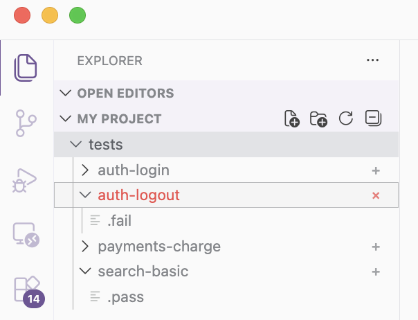

# Badger

A minimal VS Code extension that visually marks directories in the Explorer:

- `+` badge if the folder contains a `.pass` file
- `×` badge if the folder contains a `.fail` file

The markers are simple hidden files. No configuration required.

## Usage

- Create an empty file named `.pass` or `.fail` inside any folder.
- The Explorer updates automatically.

## Notes

- If both files exist, `.fail` visually dominates due to icon color semantics.
- Uses native Explorer decorations (no hacks, update-safe).

## License

MIT
