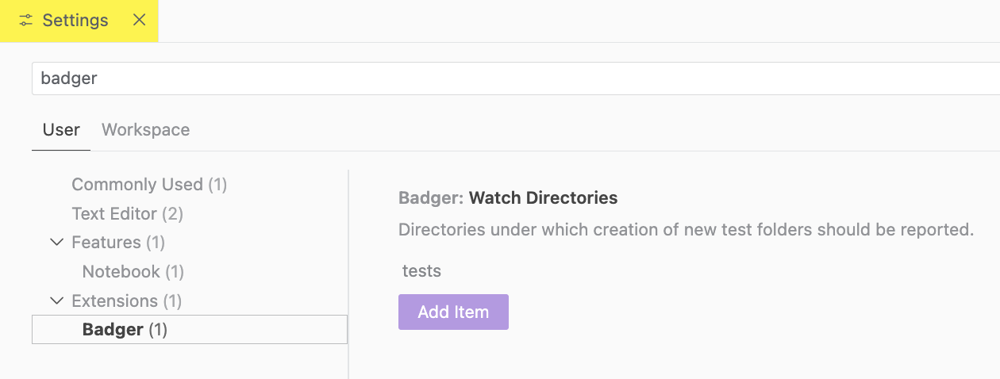

# Badger

Badger adds lightweight, filesystem-driven signals to the VS Code
Explorer.  
Folders are marked with simple badges when indicator files are present.  
Creation of new test folders can be reported via a persistent
status bar message with one-click navigation.


## Concept

Badger does not run tests or interpret results.  
The filesystem is treated as the source of truth.  
If a file exists, it means something.  
If a folder appears, attention is likely required.

---

## Folder Badging

Directories are visually annotated in the Explorer:

- A plus (__`+`__) badge is shown if the folder contains a `.pass` file.
- A red cross (__`×`__) badge is shown if the folder contains a `.fail` file.
- If both exist, `.fail` takes precedence.

Markers are simple hidden files placed directly in the folder they describe.

1. A file with optional content, named `.pass` or `.fail` is created inside any folder
2. The Explorer updates automatically


---

## New Folder Notifications

When a test runner creates a new folder (for example, a new test case
under `tests/`), a notification can be shown immediately.

- A persistent status bar message is displayed (no popups, no auto-dismiss)
- The message shows the most recently created folder
- Clicking the message navigates directly to that folder
- When another folder is created later, the same message is updated

This is useful for workflows where test runs generate directories dynamically.

1. Tests are run
2. When a new test folder is created under a watched directory:
   - A status bar message appears
   - Clicking the message navigates directly to the folder


---

## Configuration

By default, new folders are watched under: `tests/`.

This can be configured in settings, either via the GUI or by manually
editing the configuration json.



```json
{
  "badger.watchDirectories": ["tests"]
}
```

Multiple directories may be specified if needed:

```json
{
  "badger.watchDirectories": ["tests", "integration-tests"]
}
```

Only folders created under these paths will trigger notifications.

---

## Install

The [Badger
extension](https://marketplace.visualstudio.com/items?itemName=voidcsillag.badger)
can be installed from the VS Code Marketplace, or as an alternative, the
extension can be built as a `.vsix` package and then be installed
manually:

```bash
git clone https://github.com/xsnpdngv/badger.git
cd badger

npm install
npm install -g @vscode/vsce # if not installed yet
vsce package

code --install-extension badger-<version>.vsix
```

---

## License

MIT
