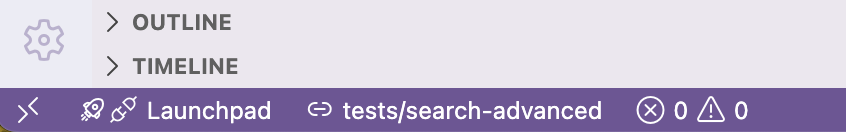

# Badger

## Overview

Badger adds lightweight, filesystem-driven signals to the VS Code Explorer.

Folders are marked with simple badges when `.pass` or `.fail` files are present, and the creation of new test folders can be reported via a persistent status bar message with one-click navigation.

Badger does not run tests or interpret results.  
It reflects state that already exists in the filesystem.

---

## Folder Badging

Directories are visually annotated in the Explorer:

- A `+` badge is shown if the folder contains a `.pass` file
- A `×` badge is shown if the folder contains a `.fail` file

Markers are simple hidden files placed directly in the folder they describe.

Tests are not run, results are not interpreted, and no structure is enforced.  
Only what the filesystem already expresses is reflected.

---

## New Folder Notifications

When a test runner creates a **new folder** (for example, a new test case under `tests/`), a notification can be shown immediately.

- A **persistent status bar message** is displayed
- The message shows the **most recently created folder**
- Clicking the message **navigates directly to that folder**
- When another folder is created later, the same message is updated (no notification spam)

This is especially useful for workflows where tests generate per-test directories dynamically.

---

## Configuration

By default, new folders are watched under:

```
tests/
```

This can be configured in settings:

```json
{
  "badger.watchDirectories": ["tests"]
}
```

Multiple directories may be specified if needed:

```json
{
  "badger.watchDirectories": ["tests", "integration-tests"]
}
```

Only folders created under these paths will trigger notifications.

---

## Usage

Install the [Badger
extension](https://marketplace.visualstudio.com/items?itemName=voidcsillag.badger)
from the VS Code Marketplace, or as an alternative, the extension can be
built as a `.vsix` package and then be debugged or installed manually:

```bash
git clone https://github.com/xsnpdngv/badger.git
cd badger

npm install
npm install -g @vscode/vsce # if not installed yet
vsce package

code --install-extension badger-<version>.vsix
```


### Folder Badging

1. An empty file named `.pass` or `.fail` is created inside any folder
2. The Explorer updates automatically


---

### Folder Creation Notification

1. Tests are run
2. When a new test folder is created under a watched directory:
   - A status bar message appears
   - Clicking the message navigates directly to the folder



---

## Notes

- If both `.pass` and `.fail` exist, `.fail` takes precedence
- Notifications are persistent and reusable (no popups, no auto-dismiss)
- Only native VS Code APIs are used (Explorer decorations, file watchers)
- Safe across VS Code updates

---

## Philosophy

The filesystem is treated as the source of truth.

If a file exists, it means something.  
If a folder appears, attention is likely required.

---

## License

MIT
